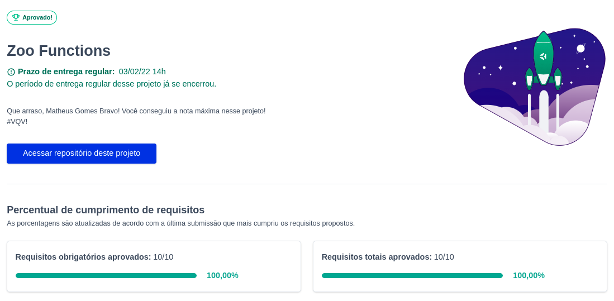

# Zoo functions
Projeto feito enquanto estudava na [Trybe](https://www.betrybe.com/), utilizando HOF's e Javascript no módulo de fundamentos. Entregue com 100% dos requisitos.

## Direitos autorais

Esse projeto foi desenvolvido por mim ([Matheus Gomes](https://www.linkedin.com/in/matheusgb/)) apenas visando o aprendizado.

